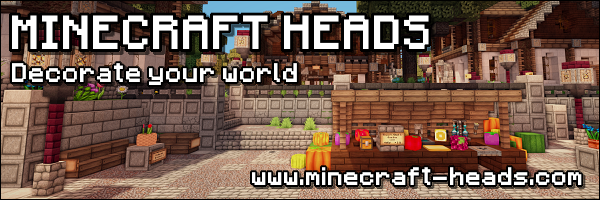

   
  <a href="https://github.com/ItsMCB/LibreHeads">LibreHeads</a> is a free and open-source Minecraft skull database selector designed for <a href="https://libregalaxy.org/play">Libre Galaxy Games</a>.
   

## Install

LibreHeads uses data generously made available by https://minecraft-heads.com/.
As of current, in order to use this plugin, it must be built from source.
The steps are as follows: clone the repo, use download.sh script to create a save of the Minecraft Heads API data, and build the jar using Gradle.

Note: This process is intentional to avoid potential API problems and respect the data's license.

This plugin depends on [VexelCore](https://github.com/ItsMCB/VexelCore). (Drop both plugin jars into your plugins folder.)

# Quick Start Guide

To be able to use `/skull` or `/head`, give yourself the `libreheads.skull.get` permission.

To search for heads, use `/skull [term]` or `/head [term]`.

## Support

Having trouble? Get help in the official [Libre Galaxy Discord](https://libregalaxy.org/chat/).
## Contributing

**New contributors welcome!**

Join us on [Discord](https://libregalaxy.org/chat/) to meet other maintainers. We'll help you get your first contribution in no time!

## Links

- Source code is licensed under [GNU General Public License v3.0](LICENSE)
- Extra heads can be added here: [Open Skulls Database](src/main/resources/)

 

To [support](https://minecraft-heads.com/support-us#banners) the Minecraft Heads project, here is their banner. Click to view their website.

